This page hosts the code and data for simulating strip mining in minecraft. The graph available on https://minecraft.wiki/w/Tutorial:Mining was made in 2012 and the source data does not appear to be available.

Use the python class to extract data from a minecraft world, and the R markdown file to simulate the mining. If you are here and interested, please read over the code and see if anything seems to be done incorrectly.

## Quick Summary of Method
I ran the simulation over an 8x8 chunk region on 14 different worlds, with gaps from 0-20. My simulation is limited by the fact that I took a 4 tall slice of the world, from y = -60 to y = -57, and strip mined at y = -59 & -58, mining the walls/ceilings and floors iff they were diamonds. If diamonds extended beyond this 4 block slice, then they were missed.
### Terminology
Gap: number of blocks left unmined between branches/strips. If gap = 5, then a strip begins every 6th block.

# Easy viewing graphs

## Pickaxes per diamond
These are the graphs I find the most informative. The old graph on the wiki was ore / block mined, which is pretty meaningless when you try to interpret it. The reciprocal is much simpler, as it tells you how many blocks you'd have to mine to get one ore. My graph below is this reciprocal, divided by the durability of an iron pickaxe. It therefore tells you how many iron pickaxes you'd have to use to mine one diamond.

## Diamonds per hour
This is my second favourite set of graphs, as it is also quite intuitive.

## Completeness
This is moreso of a diagnostic graph. I think it looks as it should.

## Completeness efficiency

# Difficult viewing graphs
Yes, they are difficult to read, but I like how they display the between-world variance.

# Scaled data graphs

The data presented below is identical to that above. To zoom in on the between-gap differences, each data point has been divided by what the value of that variable was in that world with 0 gaps. Thus, interpret each variable as multiplicative improvement on that measure when compared to mining out every block.
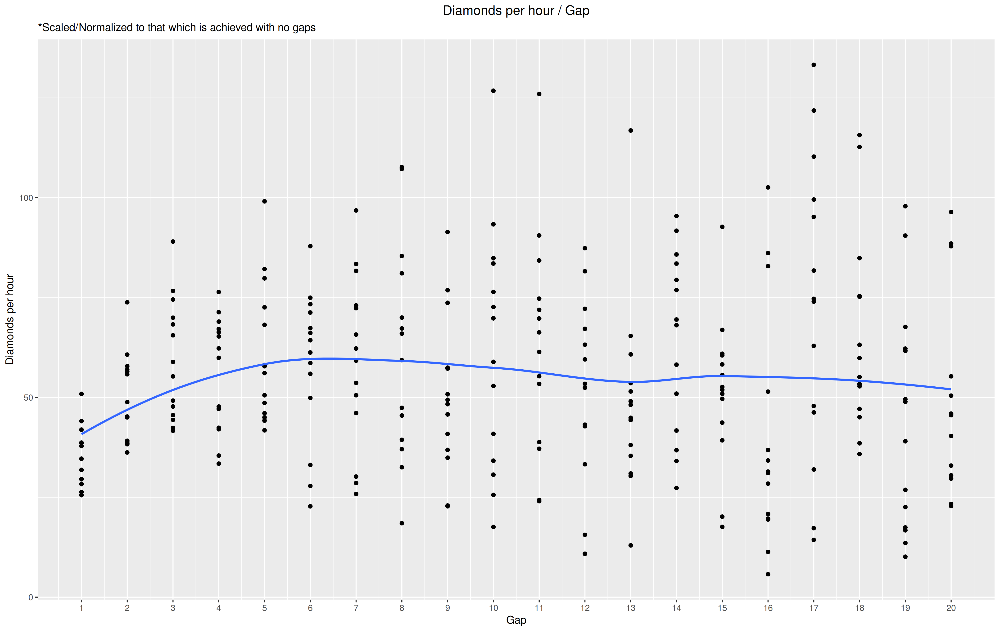
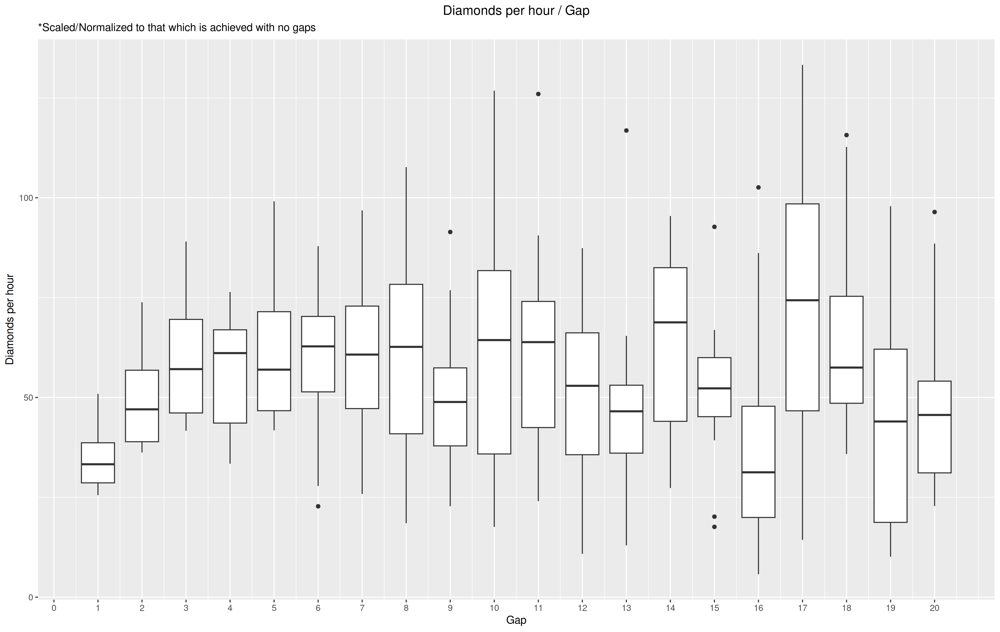
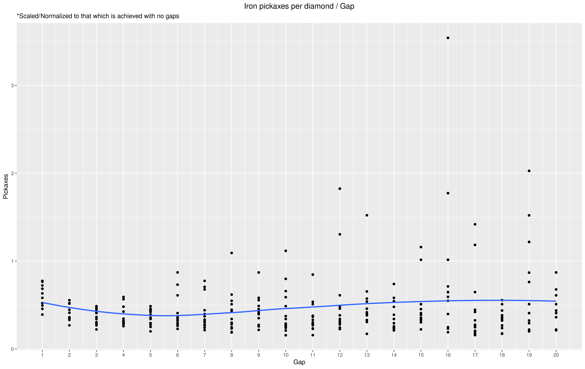
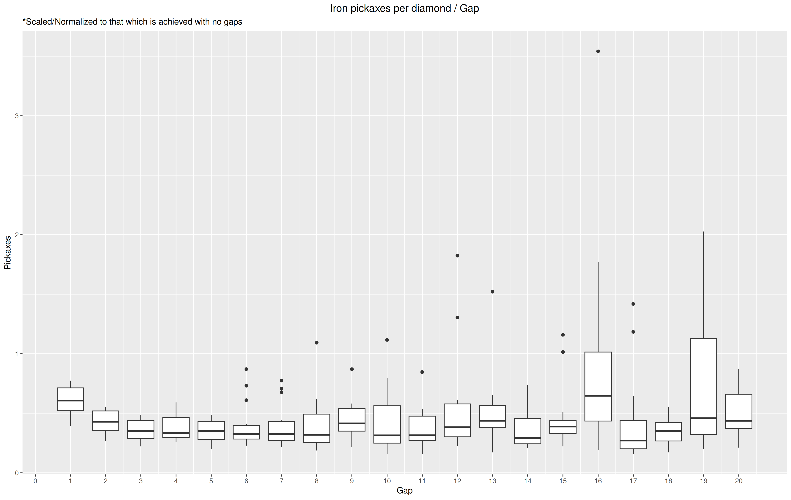
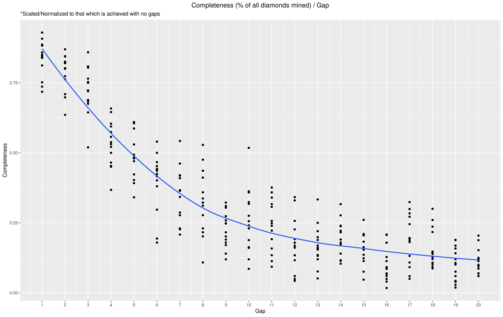
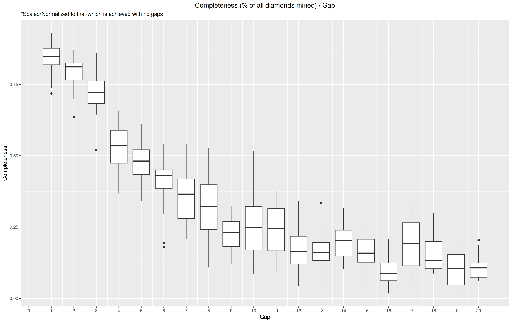
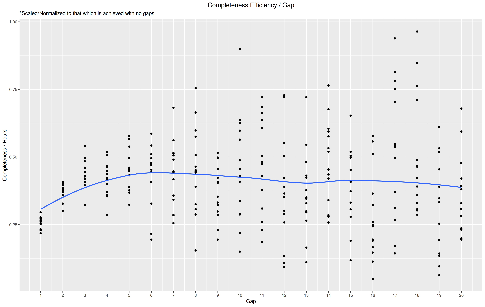
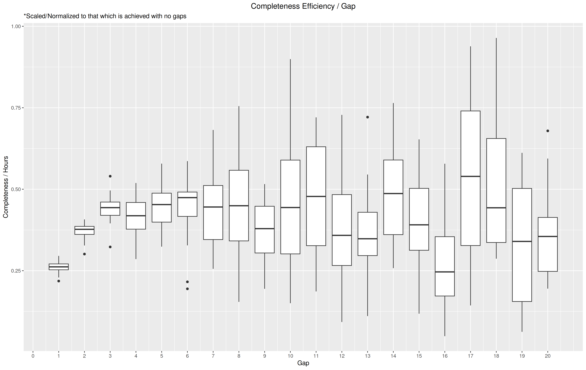
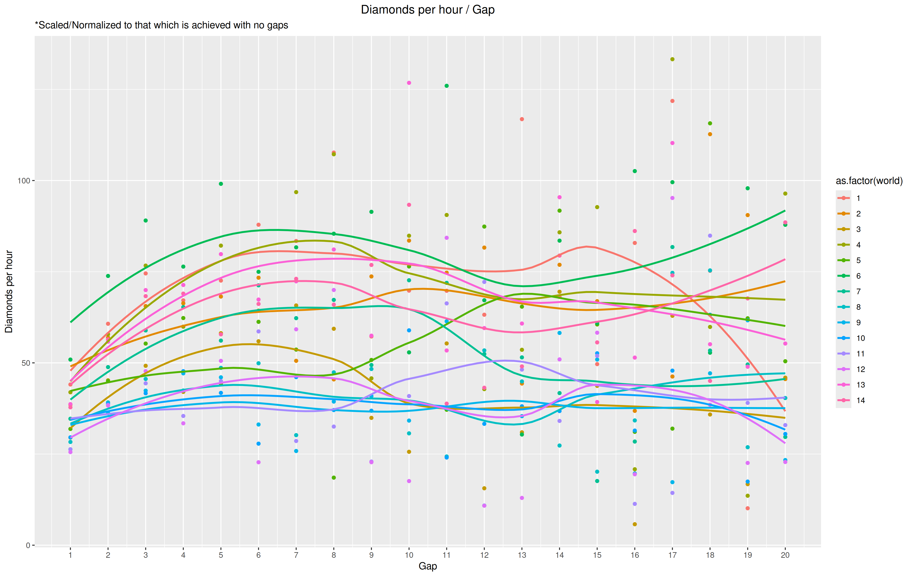
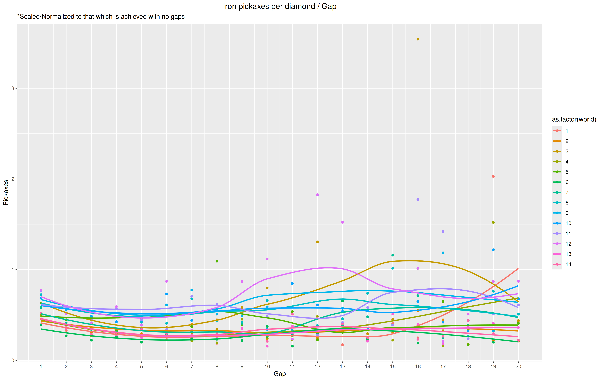
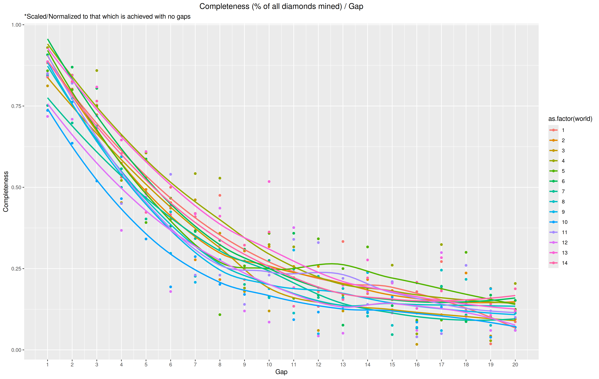
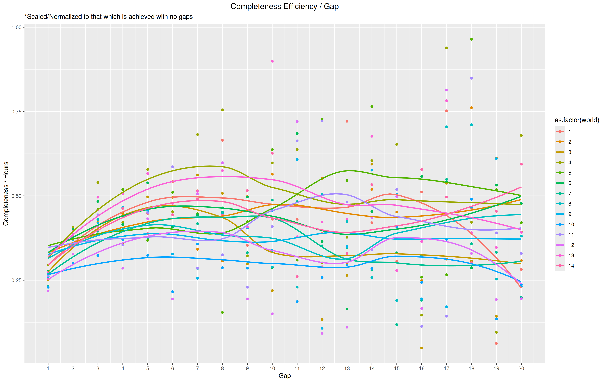

# My conclusions

A gap of somewhere between 5 and 6 appears to be where strip mining hits its peak. The LOESS curves show that after this point, the mean values of performance-related variables plateaus, while the variance dramatically increases. 

Looking closer at the data, here are some descriptives for diamonds per hour:

Gap  |  Mean  |  SD  
1    |  34.57 |  7.7    
2    |  49.40 |  11.14    
3    |  59.23 |  14.97   
4    |  56.13 |  14.28    
5    |  60.72 |  17.26   
6    |  58.19 |  18.89    
7    |  59.24 |  21.65    
8    |  61.74 |  27.08  

These descriptives can be seen here as well:

I suspect that, with a larger sample, variance would plateau at some point (likely around this 5-6 range). It should be stated that the higher mean values to the right side were produced with less time, since a greater gap utilized over the same region means a much smaller amount of blocks were ever mined. In the lower gap sizes, we can see that SD roughly doubles as the size of the gap doubles - this is likely to be due to the decrease in the number of blocks mined as gap size increases, and not due to any practical effect of strip-mining (as shown clearly by the difficult viewing graphs, which show the between-world variance at higher levels). 

In sum, these results agree with the previous one from 2012. In other words, the most efficient strip-mining strategy is to leave 5-6 or more spaces unmined between strips/branches.
