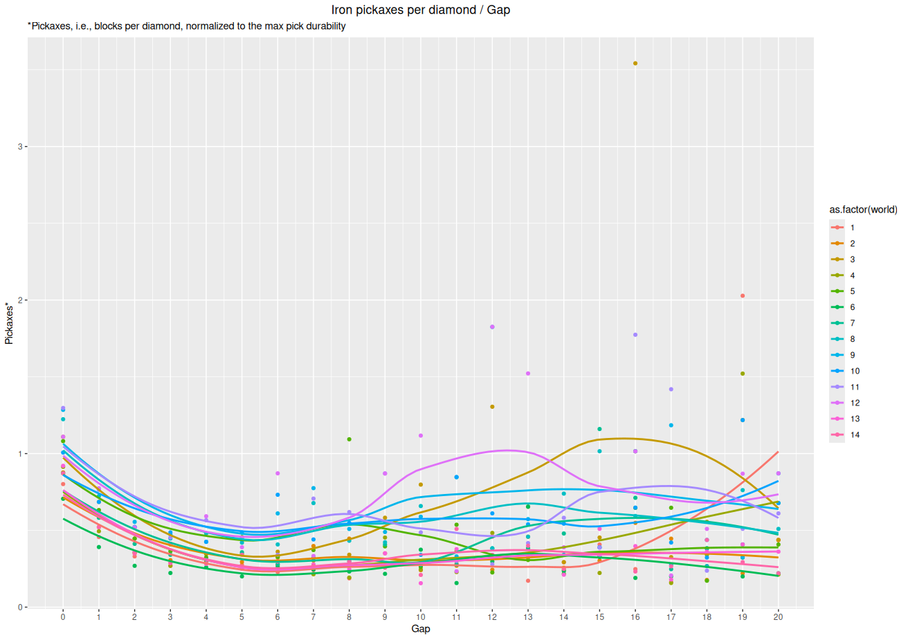
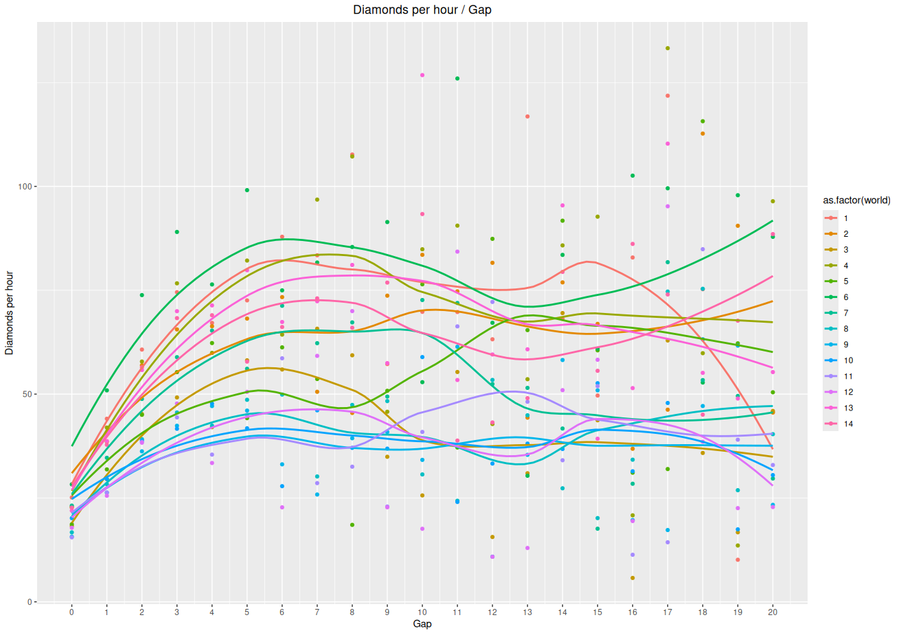
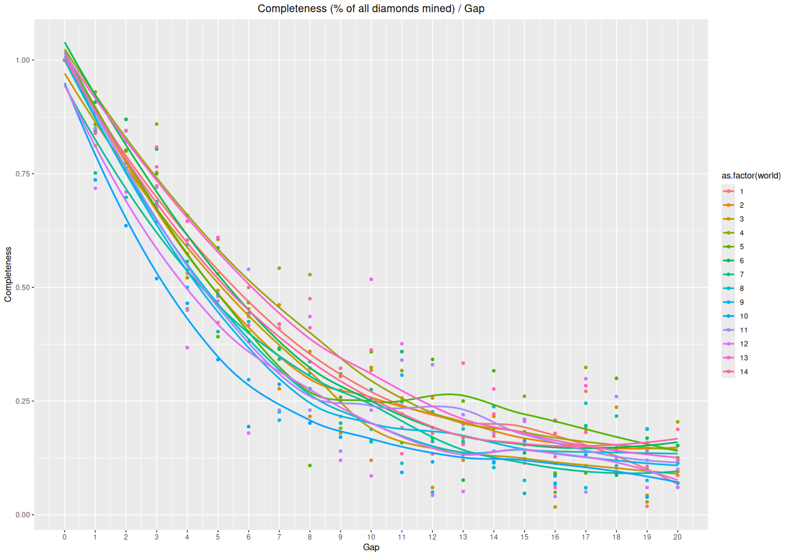
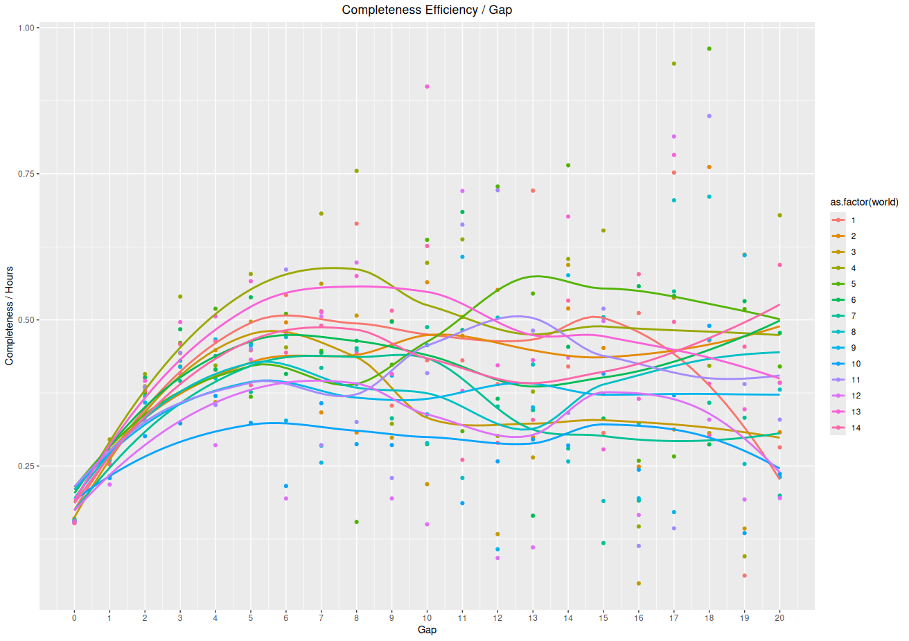

# Easy viewing graphs

## Pickaxes per diamond
These are the graphs I find the most informative. The old graph on the wiki was ore / block mined, which is pretty meaningless when you try to interpret it. The reciprocal is much simpler, as it tells you how many blocks you'd have to mine to get one ore. My graph below is this reciprocal, divided by the durability of an iron pickaxe. It therefore tells you how many iron pickaxes you'd have to use to mine one diamond.

## Diamonds per hour
This is my second favourite set of graphs, as it is also quite intuitive.

## Completeness
This is moreso of a diagnostic graph. I think it looks as it should.

## Completeness efficiency

# Difficult viewing graphs
Yes, they are difficult to read, but I like how they display the within-world variance.

